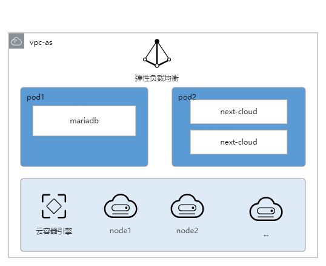

# HCIE 实验操作说明

## 实验一（云上可扩展性实验）

**实验目的**

  > 使用 EIP,CCE 安装典型 web 应用,并对其进行压力测试,使其能够实现弹性扩展能力

**实验架构**

**实验规划**

> - vpc-name: vpc-as(192.168.0.0./16)
> 
> - 子网: subnet-web(192.168.1.0/24)
>
> - 节点规格：4U16G
>
> - 账户密码：root/hcie@huawei.com
>
> - 计费方式：按量计费

## 实验二（云上可靠性实验）

**实验目的**
> 通过 SDRS 服务对云上业务进行容灾管理,实现业务可恢复性和跨 AZ 的高可以用性。
>

**实验架构**

**实验规划**

## 实验三（云上性能设计实验）

**实验目的**

> - 华为云性能提升的基本方法
> - 华为云性能测试的基本工具

**实验架构**

**实验规划**

## 实验四（云上成本设计实验）

**实验目的**

> - 华为云数据库服务的基本原理
> - 理解RDS，RDS迁移服务的使用场景

**实验架构**

**实验规划**

## 实验五（云上安全设计实验）

**实验目的**

> - 了解安全测试环境的基本要求
> 
> - 了解云上安全测试软件和工具
> 
> - 掌握云上安全测试环境的搭建和部署

**实验架构**

**实验规划**  

## 实验六（云上综合实战）

**实验目的**

> - 理解云上架构设计各个云服务的使用
>
> - 掌握从可用性、可扩展性、安全、性能、成本五个方面对云上架构设计

**实验架构**

**实验规划**  

## 实验七（上云迁移）

**实验目的**
> - 理解华为云主机迁移服务
>
> - 理解mysql迁移对象存储迁移

**实验架构**

**实验规划** 

## 实验八（容器化改造）

**实验目的**

> - 容器化改造方法
>
> - Dockerfile 的编写
>
> - 使用CCE部署容器应用

**实验架构**

**实验规划** 

## 实验九（云运维优化）

**实验目的**

> - 理解AOM、APM、LTS、CES、CTS的配置和使用
> 

**实验架构**

**实验规划** 

## 实验十（游戏容器化部署）

**实验目的**

> - 游戏容器化部署的流程
>
> - docker环境安装和docker基本命令
>
> - SWR 镜像仓库的基本使用
>
> - CCE 云容器引擎的使用
>
> - CCE 容器引擎的升级和伸缩的方法
> 

**实验架构**

**实验规划** 

